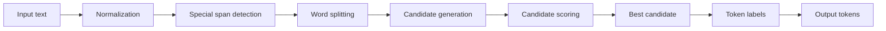

# NedoTurkishTokenizer

[Türkçe](README.md)

Morphology-aware tokenizer for Turkish with the Final1000 evaluation set.

NedoTurkishTokenizer is a Python tokenizer that segments Turkish words into root and suffix units. It uses bundled resources including a TDK-based word list, suffix table, proper noun list, acronym list, and domain vocabulary. This repository also includes the Final1000 evaluation set, frozen results, error analyses, and paper files.

## Contents

| Component | Location |
|---|---|
| Python package | [`nedo_turkish_tokenizer/`](nedo_turkish_tokenizer/) |
| Final1000 gold set | [`dataset/nedo_final1000_gold.jsonl`](dataset/nedo_final1000_gold.jsonl) |
| Final1000 CSV | [`dataset/nedo_final1000_gold.csv`](dataset/nedo_final1000_gold.csv) |
| Dataset description | [`dataset/README.md`](dataset/README.md) |
| Frozen results | [`frozen_results/RESULTS_FREEZE.md`](frozen_results/RESULTS_FREEZE.md) |
| Error analysis | [`validation/README_VALIDATION.md`](validation/README_VALIDATION.md) |
| Paper files | [`paper/`](paper/) |
| Citation file | [`CITATION.cff`](CITATION.cff) |
| Tests | [`tests/`](tests/) |
| Experiment scripts | [`experiments/`](experiments/) |

## Installation

```bash
pip install .
```

Development install:

```bash
pip install -e .
```

## Quick start

```python
from nedo_turkish_tokenizer import NedoTurkishTokenizer

tokenizer = NedoTurkishTokenizer()
print(tokenizer.tokenize("kitaplardan geldim"))
```

## Lossless mode

The normal `tokenize()` API returns clean token output. For reconstruction, use `tokenize_lossless()` and `detokenize()`.

```python
text = "İstanbul'da 14.03.2026 tarihinde görüşürüz."
encoded = tokenizer.tokenize_lossless(text)
decoded = tokenizer.detokenize(encoded)
print(decoded == text)
```

The exact roundtrip claim applies only to the `tokenize_lossless()` + `detokenize()` path.

## Token format

| Field | Description |
|---|---|
| `token` | Token text |
| `token_type` | Token type |
| `morph_pos` | Morphological position. `0` usually marks root/start, `1+` marks suffix order |

Main token types: `ROOT`, `SUFFIX`, `FOREIGN`, `PUNCT`, `NUM`, `DATE`, `UNIT`, `URL`, `MENTION`, `HASHTAG`, `EMOJI`, `ACRONYM`.

Optional metadata fields include `_suffix_label`, `_canonical`, `_caps`, `_foreign`, `_acronym`, `_expansion`, `_compound`, `_parts`, `_apo_suffix`, and `_domain`.

## Architecture



The tokenizer generates segmentation candidates for each word, scores them using lexical and suffix-based signals, and selects the best candidate. URLs, mentions, hashtags, numbers, dates, units, emoji, and punctuation are detected before word segmentation.

## Final1000

Final1000 is a 1,000-item evaluation set for Turkish morphological tokenization. It is included in this repository.

| File | Description |
|---|---|
| [`dataset/nedo_final1000_gold.jsonl`](dataset/nedo_final1000_gold.jsonl) | Main gold set |
| [`dataset/nedo_final1000_gold.csv`](dataset/nedo_final1000_gold.csv) | CSV version |
| [`dataset/README.md`](dataset/README.md) | Dataset description |
| [`frozen_results/RESULTS_FREEZE.md`](frozen_results/RESULTS_FREEZE.md) | Frozen result summary |
| [`frozen_results/README_FINAL1000.md`](frozen_results/README_FINAL1000.md) | Final1000 notes |

Hugging Face dataset: [`Ethosoft/NedoTurkishTokenizer-Final1000`](https://huggingface.co/datasets/Ethosoft/NedoTurkishTokenizer-Final1000). Zenodo DOI: [`10.5281/zenodo.21274980`](https://doi.org/10.5281/zenodo.21274980).

## Data and DOI

| Resource | Link |
|---|---|
| GitHub repository | [`NMSOfficial/NedoTurkishTokenizer`](https://github.com/NMSOfficial/NedoTurkishTokenizer) |
| Hugging Face dataset | [`Ethosoft/NedoTurkishTokenizer-Final1000`](https://huggingface.co/datasets/Ethosoft/NedoTurkishTokenizer-Final1000) |
| Zenodo DOI | [`10.5281/zenodo.21274980`](https://doi.org/10.5281/zenodo.21274980) |

## Results

The results below are reported on [`dataset/nedo_final1000_gold.jsonl`](dataset/nedo_final1000_gold.jsonl).

| System | Boundary F1 |
|---|---:|
| **NedoTurkishTokenizer** | **0.6966** |
| Morpheus neural | 0.5443 |
| XLM-R | 0.4281 |
| SP-BPE 2000 | 0.3607 |
| SP-Unigram 2000 | 0.3585 |
| BERTurk | 0.2817 |
| mBERT | 0.2801 |
| Character | 0.2882 |
| Whole-word | 0.0000 |

Additional metrics: Precision 0.7717, Recall 0.6348, exact boundary-set accuracy 64.70%, Label Precision 0.5318, Label Recall 0.4129.

Details: [`frozen_results/RESULTS_FREEZE.md`](frozen_results/RESULTS_FREEZE.md), [`validation/README_VALIDATION.md`](validation/README_VALIDATION.md).

## Known limitation

Performance drops on foreign-root + Turkish-suffix forms.

| Metric | Value |
|---|---:|
| Precision | 0.5882 |
| Recall | 0.1667 |
| F1 | 0.2597 |

Relevant file: [`validation/foreign_root_error_analysis.json`](validation/foreign_root_error_analysis.json).

## Tests

```bash
python -m compileall -q nedo_turkish_tokenizer experiments tests
python -m pytest tests/ -v
```

## Paper

Paper files are available under [`paper/`](paper/). Paper title: **NedoTurkishTokenizer: A Morphology-Aware Tokenizer and Human-Adjudicated Benchmark for Turkish**.

## Citation

Citation metadata: [`CITATION.cff`](CITATION.cff).

## License

See repository settings and `pyproject.toml`.
