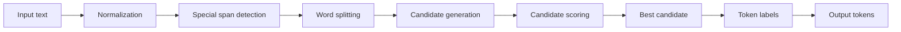

# NedoTurkishTokenizer

[English](README.en.md)

Türkçe için morfoloji farkındalıklı tokenizer ve Final1000 değerlendirme seti.

NedoTurkishTokenizer, Türkçe kelimeleri kök ve ek birimlerine ayırmaya çalışan Python tabanlı bir tokenizer'dır. Paket; TDK tabanlı kelime listesi, ek tablosu, özel ad listesi, kısaltma listesi ve alan sözlüğü kullanır. Repo ayrıca 1.000 örnekli Final1000 değerlendirme setini, deney sonuçlarını, hata analizlerini ve makale taslağını içerir.

## İçerik

| Bileşen | Konum |
|---|---|
| Python paketi | [`nedo_turkish_tokenizer/`](nedo_turkish_tokenizer/) |
| Final1000 gold set | [`dataset/nedo_final1000_gold.jsonl`](dataset/nedo_final1000_gold.jsonl) |
| Final1000 CSV | [`dataset/nedo_final1000_gold.csv`](dataset/nedo_final1000_gold.csv) |
| Dataset açıklaması | [`dataset/README.md`](dataset/README.md) |
| Dondurulmuş sonuçlar | [`frozen_results/RESULTS_FREEZE.md`](frozen_results/RESULTS_FREEZE.md) |
| Hata analizi | [`validation/README_VALIDATION.md`](validation/README_VALIDATION.md) |
| Makale dosyaları | [`paper/`](paper/) |
| Atıf dosyası | [`CITATION.cff`](CITATION.cff) |
| Testler | [`tests/`](tests/) |
| Deney scriptleri | [`experiments/`](experiments/) |

## Kurulum

```bash
pip install .
```

Geliştirme kurulumu:

```bash
pip install -e .
```

## Hızlı kullanım

```python
from nedo_turkish_tokenizer import NedoTurkishTokenizer

tokenizer = NedoTurkishTokenizer()
print(tokenizer.tokenize("kitaplardan geldim"))
```

Örnek çıktı:

```python
[
    {"token": "kitap", "token_type": "ROOT", "morph_pos": 0},
    {"token": "lar", "token_type": "SUFFIX", "morph_pos": 1, "_suffix_label": "-PL", "_canonical": "PL"},
    {"token": "dan", "token_type": "SUFFIX", "morph_pos": 2, "_suffix_label": "-ABL", "_canonical": "ABL"},
    {"token": "gel", "token_type": "ROOT", "morph_pos": 0},
    {"token": "dim", "token_type": "SUFFIX", "morph_pos": 1, "_suffix_label": "-DI1SG"}
]
```

## Batch kullanım

```python
texts = [
    "kitaplardan geldim",
    "İstanbul'da toplantıya katılamadım.",
    "Bugün 14.03.2026 tarihinde görüşürüz."
]

results = tokenizer.batch_tokenize(texts)
```

## Lossless kullanım

Normal `tokenize()` fonksiyonu temiz token çıktısı üretir. Metni geri kurmak için `tokenize_lossless()` ve `detokenize()` kullanılmalıdır.

```python
text = "İstanbul'da 14.03.2026 tarihinde görüşürüz."
encoded = tokenizer.tokenize_lossless(text)
decoded = tokenizer.detokenize(encoded)
print(decoded == text)
```

```text
True
```

Exact roundtrip iddiası sadece `tokenize_lossless()` + `detokenize()` akışı içindir.

## Token formatı

Her token bir `dict` nesnesidir.

| Alan | Açıklama |
|---|---|
| `token` | Token metni |
| `token_type` | Token türü |
| `morph_pos` | Morfolojik sıra. `0` kök/başlangıç, `1+` ek sırası |

Temel token türleri:

| Tür | Açıklama |
|---|---|
| `ROOT` | Kök |
| `SUFFIX` | Ek |
| `FOREIGN` | Yabancı veya Türkçe dışı kök |
| `PUNCT` | Noktalama |
| `NUM` | Sayı |
| `DATE` | Tarih |
| `UNIT` | Birim |
| `URL` | URL |
| `MENTION` | Mention |
| `HASHTAG` | Hashtag |
| `EMOJI` | Emoji |
| `ACRONYM` | Kısaltma |

Bazı token'larda ek metadata bulunabilir: `_suffix_label`, `_canonical`, `_caps`, `_foreign`, `_acronym`, `_expansion`, `_compound`, `_parts`, `_apo_suffix`, `_domain`.

## Mimari



Tokenizer her kelime için segmentasyon adayları üretir, adayları sözlük/eşleşme/ek uyumu gibi sinyallerle skorlar ve en yüksek skorlu çözümü seçer. URL, mention, hashtag, sayı, tarih, birim, emoji ve noktalama gibi özel span'ler segmentasyon öncesinde ayrılır.

## Final1000

Final1000, Türkçe morfolojik tokenizasyon için hazırlanmış 1.000 örnekli değerlendirme setidir. Veri seti şu an repo içinde paylaşılmaktadır.

| Dosya | Açıklama |
|---|---|
| [`dataset/nedo_final1000_gold.jsonl`](dataset/nedo_final1000_gold.jsonl) | Ana gold set |
| [`dataset/nedo_final1000_gold.csv`](dataset/nedo_final1000_gold.csv) | CSV sürümü |
| [`dataset/README.md`](dataset/README.md) | Dataset açıklaması |
| [`frozen_results/RESULTS_FREEZE.md`](frozen_results/RESULTS_FREEZE.md) | Dondurulmuş sonuç özeti |
| [`frozen_results/README_FINAL1000.md`](frozen_results/README_FINAL1000.md) | Final1000 notları |

Hugging Face veya Zenodo release'i eklendiğinde bağlantılar bu bölüme konulacaktır.

## Sonuçlar

Aşağıdaki sonuçlar [`dataset/nedo_final1000_gold.jsonl`](dataset/nedo_final1000_gold.jsonl) üzerinde raporlanmıştır.

| Sistem | Boundary F1 |
|---|---:|
| **NedoTurkishTokenizer** | **0.6966** |
| Morpheus neural | 0.5443 |
| XLM-R | 0.4281 |
| SP-BPE 2000 | 0.3607 |
| SP-Unigram 2000 | 0.3585 |
| BERTurk | 0.2817 |
| mBERT | 0.2801 |
| Character | 0.2882 |
| Whole-word | 0.0000 |

Ek metrikler:

| Metrik | Değer |
|---|---:|
| Precision | 0.7717 |
| Recall | 0.6348 |
| Exact boundary-set accuracy | 64.70% |
| Label Precision | 0.5318 |
| Label Recall | 0.4129 |

Detaylar: [`frozen_results/RESULTS_FREEZE.md`](frozen_results/RESULTS_FREEZE.md), [`validation/README_VALIDATION.md`](validation/README_VALIDATION.md).

## Bilinen sınırlılık

Code-mix ve yabancı kök + Türkçe ek yapılarında performans düşüktür.

| Metrik | Değer |
|---|---:|
| Precision | 0.5882 |
| Recall | 0.1667 |
| F1 | 0.2597 |

İlgili dosya: [`validation/foreign_root_error_analysis.json`](validation/foreign_root_error_analysis.json).

## Test

```bash
python -m compileall -q nedo_turkish_tokenizer experiments tests
python -m pytest tests/ -v
```

## Makale

| Dosya | Açıklama |
|---|---|
| [`paper/NedoTurkishTokenizer_LRE_FullLength_Final1000_TRUBA.pdf`](paper/NedoTurkishTokenizer_LRE_FullLength_Final1000_TRUBA.pdf) | PDF taslak |
| [`paper/NedoTurkishTokenizer_LRE_FullLength_Final1000_TRUBA.tex`](paper/NedoTurkishTokenizer_LRE_FullLength_Final1000_TRUBA.tex) | LaTeX kaynak |
| [`paper/cover_letter_LRE.md`](paper/cover_letter_LRE.md) | Cover letter taslağı |

Makale başlığı: **NedoTurkishTokenizer: A Morphology-Aware Tokenizer and Human-Adjudicated Benchmark for Turkish**

## Atıf

Atıf bilgisi için [`CITATION.cff`](CITATION.cff) dosyasına bakın.

## Lisans

Lisans bilgisi için repo ayarlarına ve `pyproject.toml` dosyasına bakın.
